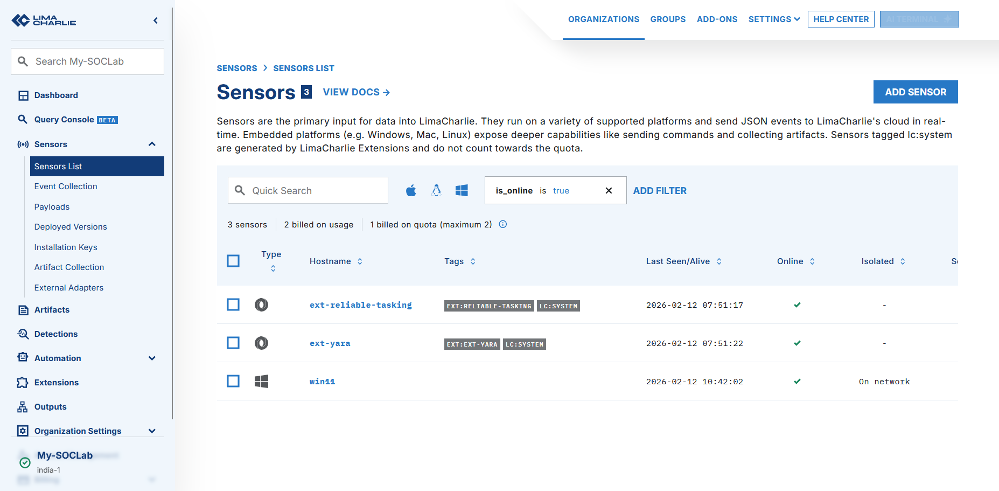
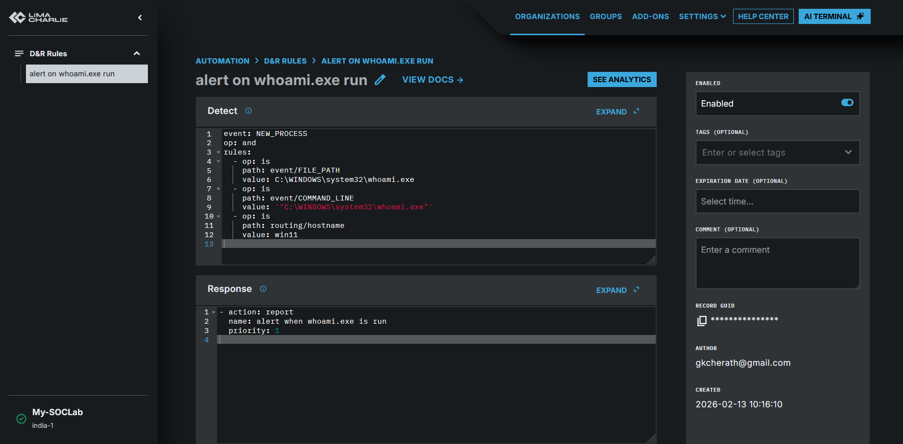
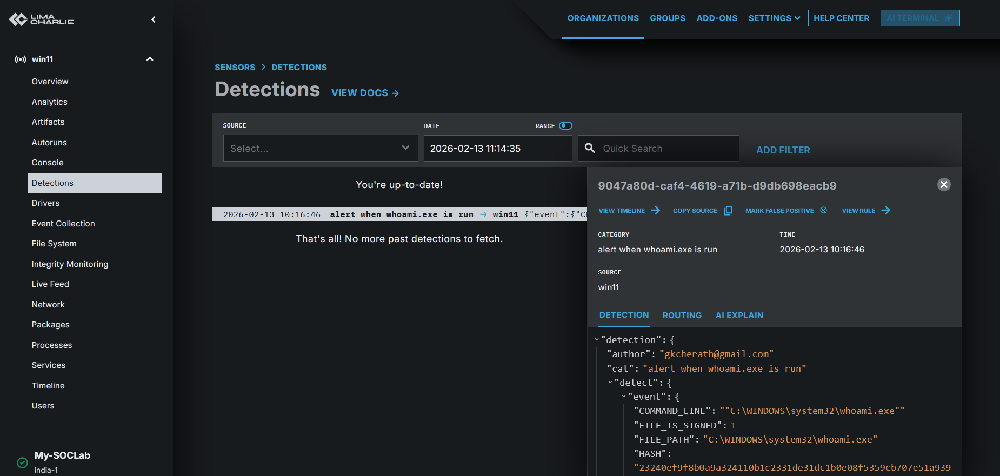

# Cloud-SOC-EDR-Lab
A hands-on Cyber Security lab using LimaCharlie and Windows 11 to detect and respond to real-time threats

## Objective
To set up a functional Security Operations Center (SOC) environment to monitor telemetry, create detection rules, and analyze real-world attack patterns using a cloud-native EDR (LimaCharlie).

## Technologies Used
* **EDR/SIEM:** LimaCharlie
* **Virtualization:** Oracle VirtualBox
* **Operating System:** Windows 11 (Victim)
* **Telemetry:** Sysmon / LimaCharlie Sensor
* **Scripting:** PowerShell

## Lab Steps
### 1. Environment Setup
* Configured a Windows 11 VM with 3GB RAM.
* Installed the LimaCharlie sensor via PowerShell to establish a cloud-to-host link.
  

### 2. Detection & Response (D&R) Rules
* Created a custom D&R rule to detect 'whoami' execution, a common discovery technique used by attackers.
* **Logic:** If `process == whoami.exe`, then `action == alert`.
  

### 3. Generating & Analyzing Alerts
* Simulated an attack by running discovery commands in the VM.
* Successfully triggered a "High Severity" alert in the LimaCharlie dashboard.

## Key Learnings
* Understanding EDR telemetry and how processes are logged.
* Writing Detection & Response rules to automate threat hunting.
